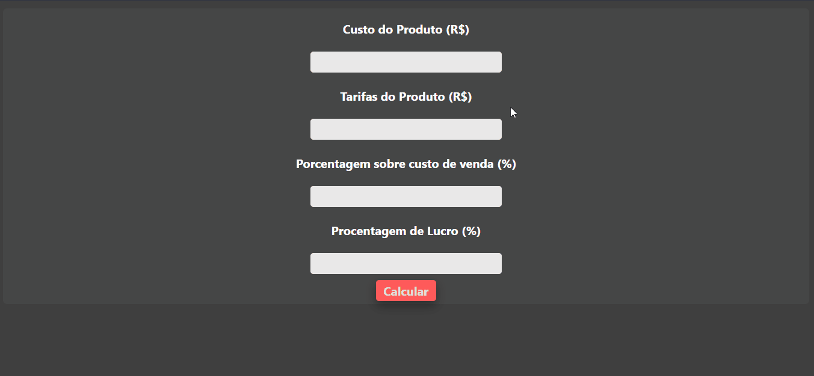

<h1> CALCULADORA DE LUCRO </h1>

This is a simple profit calculator. It was done with the languages:
<b>HTML, CSS and JavaScript</b>
 
  
  
  

<h1 align=left> <b>Feautures</b></h1>

There's no libraries used in this project, only default tags etc

<h1 align=left> <b> Getting Started </b> </h1>

1. Clone this repo using `git clone https://github.com/JeffeVargas/lucro-calculadora.git`

2. Move yourself to appropriate directory: `cd lucro-calculadora`

<h1 align=left> <b>Using mode:</b> </h1>

> PT-BR Version
> Versão PT-BR

Em primeiro lugar, você precisa preencher os campos:
- Custo do Produto;
- Tarifas do Produto;
- Porcentagem sobre custo de venda;
- Porcentagem de Lucro.

Os dois primeiros, são inseridos a quantia em `R$ (BRL)`, já os dois últimos são preenchidos em porcentagem...

<h1> <b> Custo do Produto </b> </h1>
  Esse é o preço que você paga originalmente pelo produto.
  
  No caso demonstrado, o preço do produto é de R$160

<h1> <b> Tarifas do Produto e Porcentagem sobre o custo de venda </b> </h1>
Essas tarifas são aplicadas pelo mercado sobre um tipo de produto, dependendo do mercado que você vende, muda-se a tarifa.

No caso demonstrado, temos a tabela do Mercado Livre que apresenta a porcentagem sobre o seu produto e em baixo a tarifa do produto.

<h1> <b> Porcentagem de Lucro </b> </h1>

Nesta parte é o lucro que você deseja ter sobre a venda do produto.

 Thank you for reading this far, I hope that you understood and liked LUA. We'll see in an upcoming update! 

